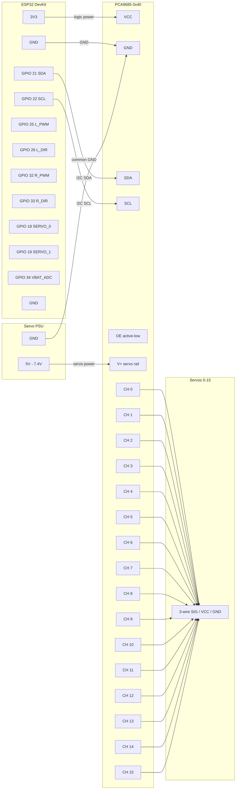

# PiBot Firmware

Reference firmware for the PiBot "muscles" layer. **Wireless-first: the ESP32 is the
primary controller** — one board joins Wi-Fi, drives the motors/servos directly, and
serves the PiBot protocol over TCP, so the Pi talks to it over Wi-Fi (or, for remote
access, the Nebula overlay) with no USB cable and no separate Arduino. All sketches speak the same wire
protocol as the host codec (`pibot/protocol/codec.py` / `protocol.h`); the host-side
mirror used for no-hardware tests is `pibot/control/echo.py`.

## Sketches

| Sketch | Board | Role |
|---|---|---|
| **`pibot_esp32/`** | **ESP32** (WROOM/S3/C3) | **PRIMARY — Wi-Fi controller**: drives motors/servos AND serves the protocol on TCP :3333. Verified: compiles to 70 % flash. |
| `pibot_arduino/` | Arduino Uno/Nano/Mega (AVR) | Wired alternative — same firmware over USB serial (5 V, no Wi-Fi). Verified: 29 % flash on an Uno. |
| `esp32_tcp_bridge/` | ESP32 | Only if you already have an AVR motor controller: dumb Wi-Fi↔serial bridge to it. |
| `pibot_arm_stm32/` | STM32F103 (Creality 4.2.2 / v1.1.x) | **Robot-arm controller**: per-joint stepper control (AccelStepper) — position/velocity, endstop homing + soft limits, e-stop latch, watchdog→hold. Verified: compiles to 7 % flash. Flash via SD card ([`pibot_arm_stm32/sd/README.md`](pibot_arm_stm32/sd/README.md)) or SWD from a Pi 5 ([`pibot_arm_stm32/swd/README.md`](pibot_arm_stm32/swd/README.md)). |

The default robot is **an ESP32 + a dual H-bridge motor driver** — fully wireless.

## Safety (mirrors `pibot/control/safety.py`)

1. **Clamp** — `drive`/`servo`/`motor` values bounded before actuation.
2. **E-stop** — `estop` latches; motion refused (NAK `estop`) until `set,estop,0`.
3. **Watchdog** — no valid command within `WATCHDOG_MS` (300 ms) → motors stop.
4. **Link-loss (ESP32)** — the TCP client disconnecting → motors stop *immediately*. A
   dropped Wi-Fi link must never leave the robot driving.

Guards 3–4 are **independent of the Pi**: a frozen brain or dead link still halts.

## Wiring — `pibot_esp32` (set in the CONFIG block)

- Dual H-bridge (TB6612/L298-style): left PWM/DIR on GPIO `25`/`26`, right on `32`/`33`.
- Servos via PCA9685 shield on I²C: SDA=GPIO `21`, SCL=GPIO `22`. Up to 16 channels (IDs 0–15).
- Battery divider on GPIO `34` (ADC1); set `VBAT_SCALE` for your divider.
- Set `WIFI_SSID` / `WIFI_PASS`.

PWM and servos use the ESP32 **LEDC** peripheral (Arduino-ESP32 core **3.x** API). The
ESP32 is 3.3 V — match your motor driver's logic level (TB6612/L298 accept 3.3 V logic).

## Build / flash

```bash
# ESP32 (install the official core first: arduino-cli core install esp32:esp32)
pibot firmware build firmware/pibot_esp32 --fqbn esp32:esp32:esp32
pibot firmware flash firmware/pibot_esp32 --fqbn esp32:esp32:esp32 --port /dev/ttyUSB0

# AVR alternative
pibot firmware build firmware/pibot_arduino --fqbn arduino:avr:uno

# Robot-arm controller (STM32F103 / Creality 4.2.2) — no native USB. Two flash routes:
#   SWD  (build at 0x08000000 — the default below; flash from a Pi 5):
arduino-cli compile --fqbn STMicroelectronics:stm32:GenF1:pnum=GENERIC_F103RETX \
  --export-binaries firmware/pibot_arm_stm32                       # -> pibotarm.bin (SWD)
#   SD card (build at the 0x7000 bootloader offset — the 0x08000000 build won't boot via SD):
arduino-cli compile --fqbn STMicroelectronics:stm32:GenF1:pnum=GENERIC_F103RETX \
  --build-property build.flash_offset=0x7000 \
  --clean --export-binaries firmware/pibot_arm_stm32               # -> pibotarm-sd.bin (SD)
# See pibot_arm_stm32/sd/README.md (SD) or pibot_arm_stm32/swd/README.md (SWD).
```

Once flashed and on Wi-Fi, the ESP32 prints its IP; the Pi connects with
`TcpTransport(<esp32-ip>, 3333)`.

### Wireless (OTA) flashing — no USB after the first flash

`pibot_esp32` includes `ArduinoOTA`, so after the **one** USB flash above you can update it
over Wi-Fi from any machine on the LAN (your Mac, or the Pi):

```bash
pibot firmware flash firmware/pibot_esp32 --fqbn esp32:esp32:esp32 --ota <esp32-ip>
pibot firmware flash firmware/pibot_esp32 --fqbn esp32:esp32:esp32 --ota <esp32-ip> --dry-run
```

It compiles the sketch and pushes the binary to the ESP32's OTA service (port 3232) via the
core's `espota.py`. Wi-Fi credentials live in a gitignored `secrets.h` (copy
`secrets.h.example`); set `PIBOT_OTA_PASS` there and pass `--ota-pass` to require a password.
The board mDNS-advertises as `pibot-esp32.local`. The robot stops its motors before an OTA
write begins, so it never drives mid-update.

## Wiring — PCA9685 servo shield (16-channel)

The PCA9685 expands servo outputs from 2 to 16 via I²C. It replaces the direct
LEDC servo pins in `pibot_esp32` and the `Servo.h` pins in `pibot_arduino`.



**Rules:**

- `V+` (green screw terminal) is **never** connected to the ESP32 — it needs its own
  supply. Servos draw 200–500 mA each; running them off the ESP32 3.3 V rail will brown
  it out immediately.
- GND is **shared**: ESP32 GND, PCA9685 GND, and servo PSU GND must all join at one
  point. Without a common ground the I²C bus has no reference and won't work.
- ESP32 is 3.3 V logic → PCA9685 accepts 3.3 V directly. No level shifter needed.
- Default I²C address is `0x40`. To chain a second shield, bridge solder jumper **A0**
  on the second board → address becomes `0x41`.

## Wired transports — GPIO-UART & I²C level requirements

The Pi's GPIO pins are **3.3 V tolerant only**. Two wired transports share this hazard:

- **GPIO-UART** (`SerialTransport("/dev/serial0")`, `uart_transport()`): enable the
  primary UART with `enable_uart=1` in `/boot/firmware/config.txt` and remove
  `console=serial0,115200` from `cmdline.txt` so Linux doesn't hold the port. Cross
  TX↔RX and share ground.
- **I²C** (`I2CTransport(bus=1, address=0x08)`): the microcontroller is an I²C slave;
  the Pi is the sole master. SDA/SCL on GPIO `2`/`3`.

**Level shifter required for 5 V devices.** A 3.3 V microcontroller (ESP32) wires
directly. A 5 V device (classic Arduino Uno) **must** go through a bidirectional
3.3 V ↔ 5 V level shifter on the UART/I²C lines — driving 5 V into a Pi GPIO pin can
permanently damage the SoC. I²C additionally needs its pull-ups to 3.3 V, not 5 V.
